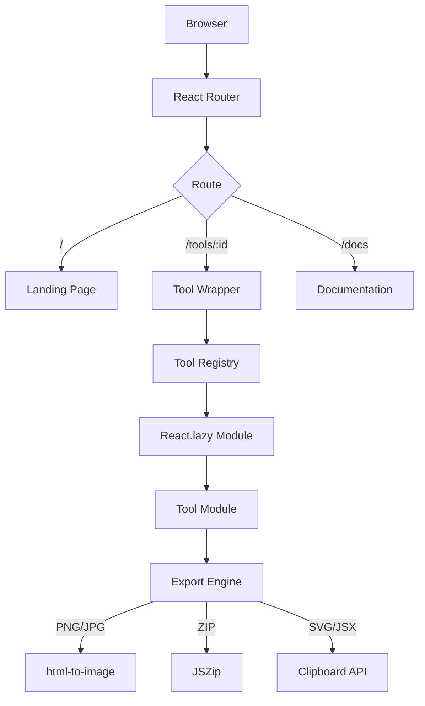

<div align="center">

<br />


<br />

# Onyx

**Developer Workspace**

A browser-based collection of professional developer tools for building, designing, generating, and exporting assets — running entirely client-side.

<br />

[](LICENSE)
[](https://react.dev)
[](https://www.typescriptlang.org)
[](https://vite.dev)
[](https://tailwindcss.com)
[](https://github.com/slythnox/Onyx-Tools/pulls)

<br />

**[Live Demo](https://slythnox.github.io/Onyx-Tools/)** · **[Documentation](https://slythnox.github.io/Onyx-Tools/docs)** · **[Report a Bug](https://github.com/slythnox/Onyx-Tools/issues)**

<br />

</div>

---

## Overview

Onyx is a self-contained, client-side developer workspace. It consolidates precision visual editors, generators, and code component catalogs into a single fast, privacy-first interface. 

Onyx eliminates the need to visit multiple ad-hoc websites for everyday assets. Everything is rendered directly in your browser, everything is exportable, and no data ever leaves your computer.

---

## Tool Gallery

Onyx ships seven production-grade studios. Each module operates independently and supports high-resolution asset export directly from the browser.

| Studio | Description | Category | Shortcut |
|---|---|---|---|
| **Code Snippets** | Generate clean code screenshots with customized window frame chrome and IDE syntax themes. | Developer | `S` |
| **Device Studio** | Render screenshots inside realistic device mockups (MacBook, iPhone, iPad) with grid alignments. | Design | `V` |
| **Icon Studio** | Customize and export 1,400+ Lucide icons as PNG, SVG, or React JSX. | Design | `I` |
| **OKLCH Generator** | Construct perceptually-uniform color systems with WCAG contrast verification. | Color | `C` |
| **Background Studio** | Design and export animated WebGL and CSS backgrounds. | Design | `B` |
| **Text Animations** | Customize and copy-paste interactive, high-performance React text animators. | Design | `T` |
| **Components** | Configure and export motion-powered UI elements (Dock, Bento Grid, Magnet). | Design | `D` |

---

## Key Features

- **Privacy First**: Zero API calls, zero analytics servers, zero accounts.
- **Precision Customization**: Dynamic control panels for real-time visual tweaking.
- **Copy-Paste Integration**: Production-ready code blocks and CSS variables instantly available for export.
- **Retina Exporting**: High-resolution image generation matching high-DPI displays.
- **Single-Page Shortcuts**: Keyboard navigation mapped globally for fast switching between studios.

---

## Architecture

Onyx is built using a decentralized, lazy-loaded modular architecture. The core application shell remains light, while heavy features load only on demand.

### Application Flow



### Folder Structure

```
onyx/
├── app/
│   ├── layouts/          # Persistent application layouts and header shell
│   ├── providers/        # Global providers (Toasts, notification hubs)
│   └── routes/           # Core route views (Landing, Wrapper, Docs)
│
├── components/
│   ├── command-palette/  # Global command search menu
│   ├── layout/           # Shared layout wrappers
│   └── ui/               # Animation presets and motion components
│
├── modules/
│   ├── background-studio/# WebGL shaders and canvas builders
│   ├── colors/           # OKLCH generator and scale tools
│   ├── components/       # Component preview workspace
│   ├── device-studio/    # Screenshot mockup editor
│   ├── icons/            # Lucide search and customizer
│   ├── snippets/         # Carbon-like code screenshot studio
│   └── text-animations/  # Text motion catalog
│
├── registry/
│   └── tools.ts          # Central metadata registry and routes loader
│
├── lib/                  # Shared core utilities (Export engines, class merges)
├── styles/               # Global styling directives and theme variables
└── public/               # Mockups, previews, and logo assets
```

---

## Tech Stack

- **Framework**: React 18.3 (Component modeling and rendering)
- **Language**: TypeScript 5.5 (Strict typing and compile safety)
- **Bundler**: Vite 5.4 (Splitting, bundling, and local development)
- **Styling**: Tailwind CSS 3.4 (Design tokens and layouts)
- **3D / WebGL**: Three.js & OGL (Hardware-accelerated shader rendering)
- **Animation**: GSAP & Framer Motion (Interpolations and transitions)
- **Exporting**: html-to-image & JSZip (DOM capture and packaging)

---

## Getting Started

### Prerequisites

Onyx requires **Node.js ≥ 18** and **npm** or another modern package manager.

### Installation

```bash
# Clone the repository
git clone https://github.com/slythnox/Onyx-Tools.git
cd Onyx-Tools

# Install dependencies
npm install

# Start the local development server
npm run dev
```

### Quality Assurance

```bash
# Verify TypeScript compile safety
npm run type-check

# Run ESLint validation
npm run lint

# Compile and minify for production
npm run build

# Preview the local production build
npm run preview
```

---

## Design & Performance Guidelines

- **WebGL Conservation**: Shaders are created once per component lifecycle and properly torn down on unmount. Stretched WebGL contexts are avoided by updating shader uniforms live using mutable reference hooks rather than triggering full React re-renders.
- **Zero-Dependency Core**: Layouts rely on CSS variables and native browser APIs where possible to minimize initial load time.
- **FPS Stability**: Heavy render loops run off a throttled `requestAnimationFrame` listener and skip frames if browser performance degrades.
- **Scroll Hijacking Mitigation**: Lenis smooth scroll listeners are isolated to the components that require them and are systematically terminated on page navigation.

---

## Contributing

We appreciate and welcome contributions to Onyx.

1. Fork the repository.
2. Create your feature branch (`git checkout -b feature/amazing-feature`).
3. Validate that typescript type-checking and lints pass (`npm run type-check` && `npm run lint`).
4. Commit your changes (`git commit -m 'feat: add support for custom device shapes'`).
5. Push to the branch (`git push origin feature/amazing-feature`).
6. Open a Pull Request.

---

## License

Distributed under the MIT License. See [LICENSE](LICENSE) for more information.
 