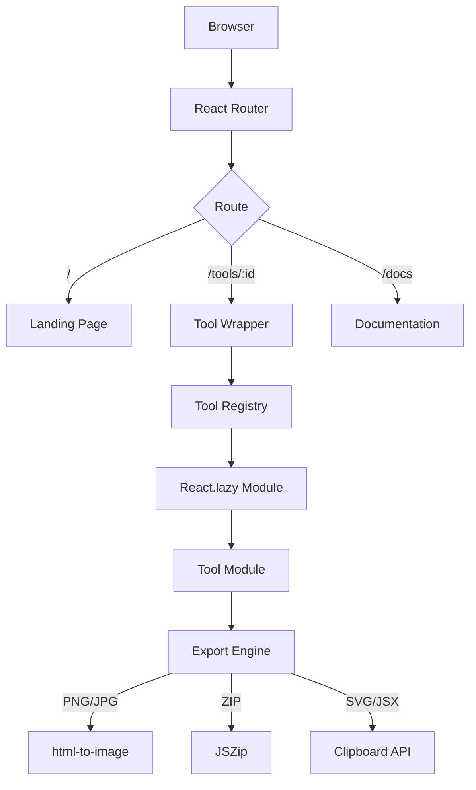
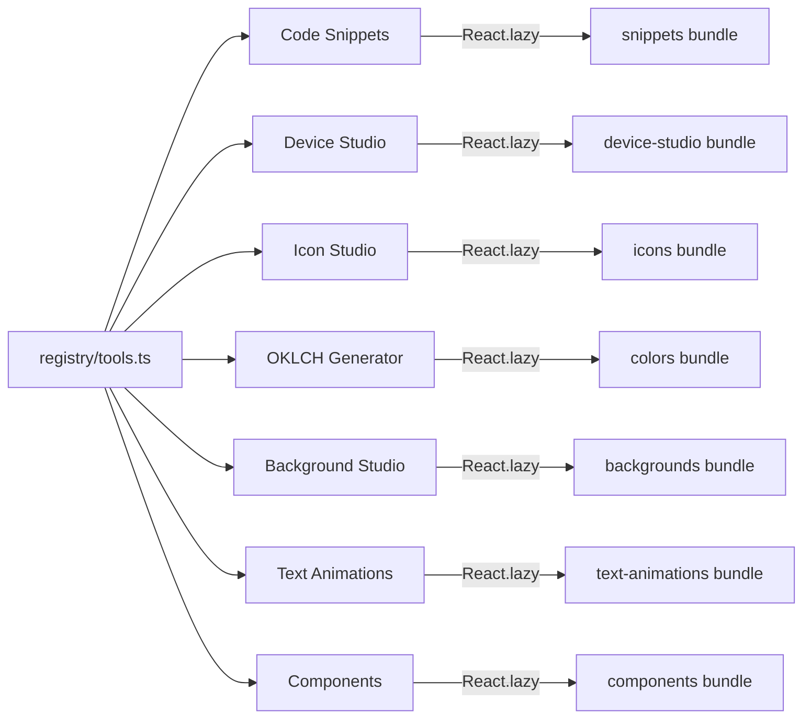

<div align="center">

<br />


<br />
<br />

# Onyx Tools

**Developer Workspace**

A browser-based collection of professional developer tools for building, designing, generating, and exporting assets — entirely client-side.

<br />

[](LICENSE)
[](https://react.dev)
[](https://www.typescriptlang.org)
[](https://vitejs.dev)
[](https://tailwindcss.com)
[](https://github.com/slythnox/Onyx-Tools/pulls)

<br />

**[Live Demo](https://slythnox.github.io/Onyx-Tools/)** · **[Documentation](https://slythnox.github.io/Onyx-Tools/docs)** · **[Report a Bug](https://github.com/slythnox/Onyx-Tools/issues)**

<br />

</div>

---

## Overview

Onyx Tools is a self-contained developer workspace that runs entirely in the browser.

No accounts. No uploads. No external APIs. No tracking.

The project exists because developers routinely visit five or six separate websites to do things that belong in one place — screenshot their code, export an icon, generate a color palette, preview a background shader. Onyx Tools consolidates all of that into a single, fast, privacy-first workspace.

Everything is client-side rendered. Everything is exportable. Everything is open source.

---

## Tools

Onyx Tools ships seven production-ready studios. Each tool operates independently and can export assets directly from the browser.

| Tool | Description | Category | Shortcut |
|---|---|---|---|
| **Code Snippets** | Generate beautiful high-retina code screenshots with IDE themes, gradient layouts, and Mac-style window chrome. Export as PNG. | Developer | `S` |
| **Device Studio** | Present screenshots inside realistic device mockups (laptops, phones, monitors) with custom layout snap-guides, rotation, and high-res exports. | Design | `V` |
| **Icon Studio** | Search, customize, and export 1,400+ Lucide icons. Adjust stroke, size, and color. Export as SVG, PNG, or JSX. | Design | `I` |
| **OKLCH Generator** | Construct perceptually-uniform color systems using the OKLCH color space. Generate semantic token scales for dark and light modes. | Color | `C` |
| **Background Studio** | Design and export animated WebGL and CSS backgrounds. Seven visual presets with full parameter control. Export as React component, Tailwind, HTML/CSS. | Design | `B` |
| **Text Animations** | Preview, customize, and export high-performance React text animation components. Multiple animation patterns with live controls. | Design | `T` |
| **Components** | Preview, configure, and export interactive React UI components. Live parameter panel with source code and CSS export. | Design | `D` |

---

## Architecture

### Application Flow



### Module Registry



### Project Structure

```
onyx-tools/
├── app/
│   ├── layouts/          # AppLayout — persistent shell, nav, footer
│   ├── providers/        # App-level context providers
│   └── routes/
│       ├── landing.tsx   # Home page with hero and tool grid
│       ├── tool-wrapper.tsx  # Shared wrapper for all tool modules
│       └── docs.tsx      # Documentation page
│
├── components/
│   └── ui/               # Reusable primitives (Button, Input, Select…)
│                         # Production UI components (Dock, Magnet, MagicBento…)
│
├── modules/
│   ├── snippets/         # Code Snippets studio
│   ├── icons/            # Icon Studio
│   ├── colors/           # OKLCH Generator
│   ├── background-studio/  # Background Studio (WebGL shaders)
│   ├── text-animations/  # Text Animations studio
│   └── components/       # Components catalog
│
├── registry/
│   └── tools.ts          # Central tool metadata registry
│
├── lib/                  # Shared utilities (cn, syntax highlighter…)
├── styles/               # Global CSS, design tokens
├── types/                # Shared TypeScript type definitions
├── public/               # Static assets
└── vite.config.ts        # Build configuration
```

---

## Technology Stack

| Layer | Technology | Version | Purpose |
|---|---|---|---|
| Framework | React | 18.3 | Component model and rendering |
| Language | TypeScript | 5.5 | Type safety across all modules |
| Bundler | Vite | 5.4 | Dev server, production builds, code splitting |
| Styling | Tailwind CSS | 3.4 | Utility-first layout and design system |
| Routing | React Router | 7 | Client-side SPA navigation |
| 3D / WebGL | Three.js + React Three Fiber | 0.180 | Hardware-accelerated background shaders |
| WebGL (lightweight) | OGL | 1.0 | Minimal WebGL renderer for custom shaders |
| Animation | GSAP | 3.15 | Timeline-based component animations |
| Animation | Framer Motion / Motion | 12 | Declarative React transitions |
| Scroll | Lenis | 1.3 | Smooth scroll engine for ScrollStack |
| Icons | Lucide React | 0.344 | 1,400+ vector icons |
| Image Export | html-to-image | 1.11 | DOM-to-PNG rendering pipeline |
| Compression | JSZip | 3.10 | Multi-asset ZIP packaging |

---

## Installation

**Requirements:** Node.js ≥ 18

```bash
# Clone
git clone https://github.com/slythnox/Onyx-Tools.git
cd Onyx-Tools

# Install dependencies
npm install

# Start the development server
npm run dev
```

```bash
# Type check (zero errors expected)
npm run type-check

# Lint
npm run lint

# Production build
npm run build

# Preview production build locally
npm run preview
```

The dev server starts at `http://localhost:5173` by default.

---

## Design Philosophy

**Performance by default.** Tool modules load lazily. Bundles are split per route. WebGL contexts are reused. Animation frames are throttled. The goal is that heavy tools feel light.

**No abstractions without purpose.** The codebase avoids framework layers and wrapper patterns unless they solve a concrete problem. The tool registry is a flat array. Routes are a switch statement. Exports are direct DOM operations.

**Modularity.** Adding a new tool means adding an entry to `registry/tools.ts` and creating a module folder. Nothing else changes. The shell, navigation, and export engine are shared infrastructure.

**Developer experience.** Every tool follows the same interaction model: left panel for controls, right panel for preview, top bar for export. Keyboard shortcuts work from the tools directory. Copy-paste code is always ready.

---

## Performance

| Concern | Approach |
|---|---|
| Initial load | Only the landing page and shell load on first visit |
| Tool modules | Loaded via `React.lazy` on first navigation to each tool |
| WebGL contexts | Created once per component, cleaned up on unmount |
| Mouse tracking | Throttled inside `requestAnimationFrame` to prevent layout thrashing |
| Scroll animation | Lenis instances are fully terminated on component unmount |
| Export pipeline | DOM rendering via `html-to-image` runs off the main thread where possible |
| Bundle size | Three.js is isolated to background modules; never loaded for non-WebGL tools |

---

## Contributing

Contributions are welcome. Please read the following before opening a pull request.

**Bug reports**

Open an issue with a clear description of the problem, steps to reproduce, and your browser version.

**Feature requests**

Open an issue describing the feature, the use case it solves, and any relevant prior art.

**Pull requests**

```bash
# Fork the repository, then:
git checkout -b feature/your-feature-name

# Make your changes
# Run type check before committing
npm run type-check
npm run lint

git commit -m "feat: describe your change clearly"
git push origin feature/your-feature-name
```

Open a pull request against `main`. Include a clear description of what changed and why.

For new tools, follow the existing module structure and register the tool in `registry/tools.ts`.

---

## License

MIT 

---

<div align="center">

Maintained by [slythnox](https://github.com/slythnox)

<br />

Built with [React](https://react.dev) · [Vite](https://vitejs.dev) · [Three.js](https://threejs.org) · [OGL](https://github.com/oframe/ogl) · [GSAP](https://gsap.com) · [Lucide](https://lucide.dev) · [ReactBits](https://reactbits.dev)

</div>
